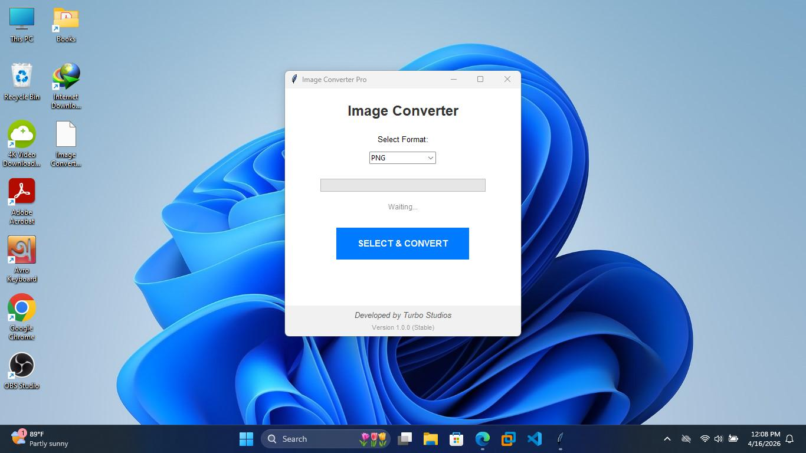

# Hello from Turbo Studios
Hey Guys, hope you well.

This is Tbm Tahmid, and I made a simple offline Image converter. Project name is ```Image Converter Pro```.

Well are you want to konw more, go to the release section.

Want to Install? Goto the release section and download the [Image.Converter.Pro.exe](https://github.com/TurboStudios26/Image-Converter-Pro/releases/download/1.0.0/Image.Converter.Pro.exe) for ```Windows```.

Want to download in ```Linux```? No problem! download the [Image.Converter.Pro](https://github.com/TurboStudios26/Image-Converter-Pro/releases/download/1.0.0/Image.Converter.Pro) and then open terminal where you
download it and run this command
```bash
#for execution
chmod +x "Image Converter Pro"
```
And now every time you open in linux just type
```bash
#for run
./"Image Converter Pro"
```
# Screenshot
Here are the Screenshots of the app


